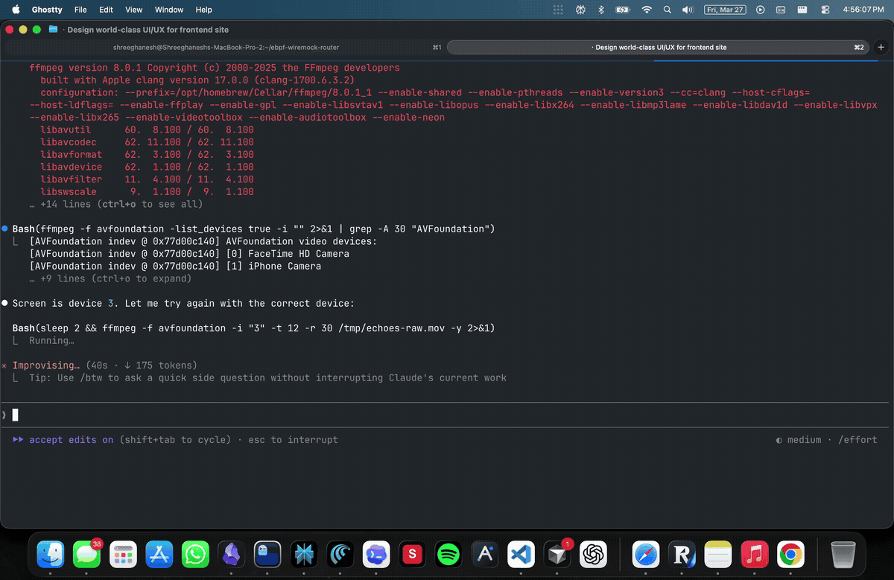

# Echoes

**Accurate audio transcription powered by OpenAI Whisper — everything stays on your computer.**



---

Drop any audio file. Watch it transcribe in real time. Your recordings, transcripts, and API key never leave your machine.

## Features

**Transcription**
- Drag-and-drop or click to upload — MP3, WAV, M4A, FLAC, OGG, WebM, WMV up to 250 MB
- Real-time streaming — partial text appears as Whisper processes each segment
- Large file support — files over 24 MB are auto-chunked into 10-minute segments with `ffmpeg`, transcribed in parallel, and reassembled with correct timestamps
- Queue multiple files — drop a second file while one is already transcribing; it queues automatically
- Cancel anytime — stop an active transcription and return home instantly

**Reading & Playback**
- Synced audio player — timed transcript blocks highlight as audio plays; click any block to seek
- Serif reading typography — transcript content renders in a comfortable reading font, distinct from the UI
- Copy & export — copy to clipboard, or download as plain text or Markdown

**Library**
- Disk-based storage — transcripts and audio saved directly to a folder you choose on your computer, not browser storage
- Folders — organise transcripts into named folders
- Bulk actions — select, move, or delete multiple transcripts at once
- Recents — most recent transcripts visible on the home screen without opening the library

**Privacy**
- Your OpenAI API key is stored only in `localStorage` and sent directly to OpenAI — never to Echoes servers
- All library data lives in a folder on your file system. No accounts, no cloud sync, no telemetry

## Getting Started

**Requirements**
- Node.js 20+
- An [OpenAI API key](https://platform.openai.com/api-keys) with Whisper access
- `ffmpeg` on your `PATH` *(only needed for files over 24 MB)*

```bash
# macOS
brew install ffmpeg
```

**Run**

```bash
cd app
npm install
npm run dev -- -p 3456
```

Open `http://localhost:3456`, drop an audio file, and follow the prompt to choose a save folder.

## How It Works

| File size | Path |
|-----------|------|
| ≤ 24 MB | Sent directly to the Whisper API; status and text stream back via NDJSON |
| > 24 MB | Split into 10-min MP3 chunks with `ffmpeg` → each chunk transcribed in parallel → reassembled with offset-corrected timestamps |

Transcription runs inside a React hook at the page root, so navigating between views never interrupts an in-progress job. A persistent indicator bar shows filename, progress percentage, and a live view button.

## Project Structure

```
app/
├── src/
│   ├── app/
│   │   ├── page.tsx                  # App shell, view routing, transcription state
│   │   └── api/transcribe/route.ts   # Whisper API, chunking, NDJSON streaming
│   ├── components/
│   │   ├── upload-zone.tsx           # Drag-and-drop, API key input
│   │   ├── live-transcript.tsx       # Real-time progress and streaming text
│   │   ├── transcript-viewer.tsx     # Reading view with synced audio player
│   │   ├── history-sidebar.tsx       # Library drawer with search and bulk actions
│   │   └── waveform.tsx              # Animated waveform visualization
│   └── lib/
│       ├── use-transcription.ts      # Fetch/streaming lifecycle hook
│       ├── fs-library.ts             # File System Access API helpers
│       ├── library-ops.ts            # CRUD operations on the library
│       └── store.ts                  # Shared utilities and formatters
```

## Scripts

```bash
npm run dev      # Start dev server
npm run build    # Production build
npm run lint     # ESLint
```

## Stack

Next.js · TypeScript · Tailwind CSS · Framer Motion · OpenAI Whisper · File System Access API
